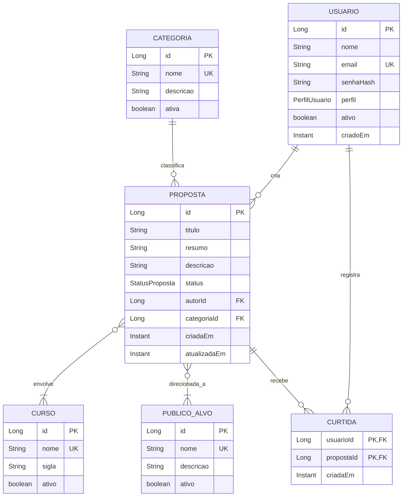

# Modelo de dados — propostas interdisciplinares

Este documento fixa o vocabulário e as regras iniciais do domínio da API da Fatec Antonio Brambilla. A implementação será incremental. A primeira coleção Insomnia registra o contrato; persistência e relacionamentos serão construídos na etapa 02.

## Decisões de escopo

- Uma proposta descreve uma ideia de trabalho interdisciplinar.
- O escopo institucional é a Fatec Antonio Brambilla.
- Categorias, cursos e públicos-alvo são listas controladas para manter consistência em formulários e filtros.
- O catálogo oferece todos os cursos ativos da Fatec Antonio Brambilla.
- A listagem retorna 10 propostas por página. `page` é zero-based e não há parâmetro para alterar o tamanho.
- Cada proposta tem um autor. O backend identifica o autor pela sessão autenticada quando a segurança entrar na etapa 04.
- Cada usuário pode curtir uma proposta no máximo uma vez. A curtida é uma entidade associativa, não apenas um contador editável no formulário.
- `DELETE` arquiva a proposta. Isso preserva histórico e curtidas; propostas arquivadas não aparecem nas consultas públicas por padrão.
- As regras de propriedade e perfil serão aplicadas na etapa de segurança. O cliente não escolhe o autor enviando um `autorId`.

## Entidades

### `Proposta`

| Atributo | Tipo sugerido | Regra |
|---|---|---|
| `id` | `Long` | Chave primária gerada pelo banco. |
| `titulo` | `String` | Obrigatório, 5 a 120 caracteres. |
| `resumo` | `String` | Obrigatório, até 300 caracteres; usado nos cartões e resultados. |
| `descricao` | `String` | Obrigatório; texto detalhado, limite inicial de 10.000 caracteres. |
| `publicosAlvo` | conjunto de `PublicoAlvo` | Um ou mais públicos controlados, por exemplo, “pequenos produtores locais”. |
| `status` | enum `StatusProposta` | `PUBLICADA` ou `ARQUIVADA`; nova proposta começa publicada na primeira versão. |
| `autor` | `Usuario` | Muitos projetos para um autor. Definido pelo backend. |
| `categoria` | `Categoria` | Muitas propostas para uma categoria. Obrigatória. |
| `cursos` | conjunto de `Curso` | Muitos-para-muitos; um ou mais cursos ativos envolvidos. |
| `criadaEm` | `Instant` | Atribuída pelo servidor ao criar. |
| `atualizadaEm` | `Instant` | Atualizada pelo servidor em alterações. |

### `Usuario`

| Atributo | Tipo sugerido | Regra |
|---|---|---|
| `id` | `Long` | Chave primária. |
| `nome` | `String` | Obrigatório, até 120 caracteres. |
| `email` | `String` | Obrigatório e único; normalizado para minúsculas. |
| `senhaHash` | `String` | Hash produzido pelo encoder do Spring Security; nunca devolver em DTO. |
| `perfil` | enum `PerfilUsuario` | `USER` ou `ADMIN`; papel atribuído no servidor. |
| `ativo` | `boolean` | Permite desativar conta sem apagar autoria/histórico. |
| `criadoEm` | `Instant` | Atribuído pelo servidor. |

### `Categoria`

`id: Long`, `nome: String` (único, obrigatório, até 80 caracteres), `descricao: String` (opcional, até 300 caracteres) e `ativa: boolean`. Categorias inativas deixam de ser oferecidas em novas propostas, mas continuam legíveis nas propostas antigas.

### `PublicoAlvo`

`id: Long`, `nome: String` (único, obrigatório, até 100 caracteres), `descricao: String` (opcional, até 300 caracteres) e `ativo: boolean`. A proposta pode estar associada a um ou mais públicos-alvo ativos. O catálogo é controlado por ADMIN.

### `Curso`

`id: Long`, `nome: String` (único, obrigatório, até 120 caracteres), `sigla: String` (opcional, única quando informada, até 20 caracteres) e `ativo: boolean`. O catálogo disponibiliza todos os cursos ativos da Fatec Antonio Brambilla; cursos inativos deixam de ser selecionáveis em novas propostas e filtros.

### `Curtida`

Associação entre `Usuario` e `Proposta`, com `criadaEm: Instant`. A chave primária composta (`usuarioId`, `propostaId`) impede curtidas repetidas no banco. A API calcula a quantidade de curtidas e se o usuário atual curtiu; ela não aceita um contador definido pelo cliente.

## Relações



## Contrato HTTP planejado

| Método e rota | Operação | Acesso previsto |
|---|---|---|
| `GET /api/propostas` | Lista 10 propostas por página; filtros `q`, `categoriaId`, `publicoAlvoId`, `cursoId`, `status` e `page`. | Público, apenas publicadas por padrão. |
| `GET /api/propostas/{id}` | Detalhe da proposta. | Público se publicada. |
| `POST /api/propostas` | Cria proposta; recebe título, resumo, descrição, IDs dos públicos-alvo, categoria e cursos. | USER ou ADMIN. |
| `PUT /api/propostas/{id}` | Atualiza campos editáveis da proposta. | Autor ou ADMIN. |
| `DELETE /api/propostas/{id}` | Arquiva a proposta. | Autor ou ADMIN. |
| `PUT /api/propostas/{id}/curtida` | Registra a curtida do usuário atual; chamada repetida mantém o mesmo resultado. | USER ou ADMIN. |
| `DELETE /api/propostas/{id}/curtida` | Remove a curtida do usuário atual. | USER ou ADMIN. |
| `GET /api/categorias` | Lista categorias ativas para formulários e filtros. | Público. |
| `GET /api/cursos` | Lista cursos ativos para formulários e filtros. | Público. |
| `GET /api/publicos-alvo` | Lista públicos-alvo ativos para formulários e filtros. | Público. |

### Respostas HTTP esperadas

- `GET` retorna `200 OK`; identificador indisponível retorna `404 Not Found`.
- `POST /api/propostas` retorna `201 Created` e o recurso criado (idealmente com cabeçalho `Location`).
- `PUT` retorna `200 OK` com a representação atualizada, ou `404 Not Found`.
- `DELETE` retorna `204 No Content` após arquivar, ou `404 Not Found`.
- Dados inválidos retornam `400 Bad Request` com mensagens associadas aos campos.
- A etapa de segurança define `401 Unauthorized` para pessoa não autenticada e `403 Forbidden` para pessoa sem permissão.

Exemplo do corpo de criação:

```json
{
  "titulo": "Horta inteligente para a comunidade",
  "resumo": "Sistema acessível para monitorar uma horta comunitária.",
  "descricao": "Proposta de trabalho interdisciplinar para apoiar o cultivo local.",
  "publicoAlvoIds": [1, 2],
  "categoriaId": 1,
  "cursoIds": [1, 2]
}
```

Login, registro e manutenção administrativa de categorias, cursos e públicos-alvo serão especificados junto com a segurança e a interface. Respostas de listagem incluem `quantidadeCurtidas`; para usuário autenticado podem incluir `curtidaPeloUsuarioAtual`. A paginação usa `page` (começando em zero) e retorna sempre 10 itens por página. DTOs nunca incluem hash de senha.

## Padrões e arquitetura

Spring MVC orienta o fluxo Controller → Service → Repository. JPA implementa persistência. `Usuario` tem perfil simples na primeira versão; não é necessário criar uma hierarquia de subclasses para `ADMIN` e `USER`. O padrão GoF **Strategy** só deve entrar se surgirem estratégias de busca realmente intercambiáveis. Uma tabela associativa de curtidas existe por regra de domínio e integridade, não para aplicar um padrão de projeto.

## Decisões definidas e melhorias futuras

- O catálogo apresenta todos os cursos ativos.
- Públicos-alvo são selecionados de uma lista controlada e podem ser associados em conjunto à proposta.
- Cada página da listagem contém 10 propostas; `page` é zero-based.
- Rascunhos, comentários e anexos estão aprovados como melhorias futuras, fora do primeiro ciclo. Registrar como backlog para etapas posteriores, depois do CRUD, busca, curtidas, documentação, segurança e interface iniciais.
