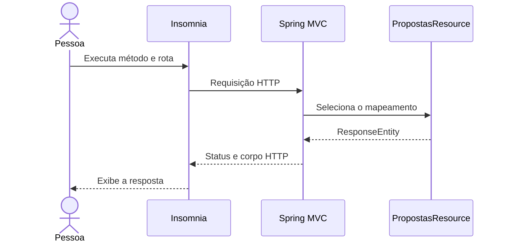

# Tutorial 1 — Contrato REST e Insomnia

## Missão

Implementar os primeiros endpoints REST de propostas da Fatec Antonio Brambilla a partir do contrato. Ao terminar, você terá controllers, validação HTTP e uma coleção Insomnia para percorrer o CRUD, filtros, catálogos e curtidas. Nesta etapa os dados ficam em memória; a etapa JPA substituirá o armazenamento.

## Antes de começar

- JDK 17 instalado.
- Insomnia instalado.
- Repositório clonado e terminal aberto na raiz.

## 1. Inicie a API

Execute `./gradlew bootRun`. O recurso principal fica em `src/main/java/br/com/fatecararas/piapi/resources/PropostasResource.java`; os catálogos ficam em `CatalogosResource`. A aplicação começa com uma proposta demonstrativa e listas de referência para que você possa experimentar as requisições sem configurar um banco.

## 2. Importe a coleção

No Insomnia, use **Import** e selecione `insomnia/propostas-insomnia.json`. A coleção inclui listagem e filtros, detalhe, criação, atualização, remoção lógica, curtidas e leitura dos catálogos. Execute as chamadas e observe o status e o corpo de resposta.

## 3. Leia o controller

`@RestController` registra um controller que escreve respostas HTTP; `@RequestMapping` define o prefixo da rota; cada anotação `@GetMapping`, `@PostMapping`, `@PutMapping` ou `@DeleteMapping` associa um verbo à operação. `PropostasResource` delega regras ao `PropostaService`; não guarda estado HTTP nem dados diretamente no controller.

| Operação | Verbo | Rota | Uso esperado |
|---|---|---|---|
| Listar | GET | `/api/propostas` | Obter página de propostas; aceita filtros |
| Consultar uma | GET | `/api/propostas/{id}` | Obter uma proposta |
| Criar | POST | `/api/propostas` | Enviar uma nova proposta |
| Atualizar | PUT | `/api/propostas/{id}` | Atualizar os campos editáveis |
| Arquivar | DELETE | `/api/propostas/{id}` | Retirar da listagem pública sem apagar o histórico |
| Curtir | PUT | `/api/propostas/{id}/curtida` | Registrar uma curtida do usuário autenticado |
| Remover curtida | DELETE | `/api/propostas/{id}/curtida` | Desfazer a própria curtida |

Os filtros iniciais são `q`, `categoriaId`, `publicoAlvoId`, `cursoId`, `status` e `page`. `q` busca título, resumo e descrição. Cada página contém 10 propostas. Públicos-alvo são selecionados de uma lista controlada. A definição de atributos, relações e regras está em [00-modelo-dados.md](00-modelo-dados.md). O conteúdo de criação e atualização usa esse modelo e a coleção como referência.

## O caminho de uma requisição

## 4. Experimente e registre

Escolha três chamadas da coleção e anote método, caminho, parâmetros, JSON de entrada e resposta de sucesso. Observe que públicos-alvo são escolhidos por ID no catálogo e que cada página contém 10 propostas. Discuta por que curtida usa um recurso próprio e por que excluir uma proposta significa arquivá-la.

As listas de cursos, categorias e públicos-alvo e a proposta inicial são dados demonstrativos em memória. Nesta etapa, todas as chamadas de escrita usam um usuário demonstrativo; não há login nem controle de acesso até a etapa Spring Security. Reiniciar a aplicação restaura os dados iniciais.

## Desafio

Revise o contrato com outra dupla. Confirme se os nomes dos campos são claros, se é possível descobrir as propostas por categoria, conteúdo, público-alvo e curso, e se os status HTTP esperados estão registrados. Leve as decisões para a etapa de implementação.

## Pronto quando

- A aplicação inicia e a coleção importa no Insomnia.
- As operações retornam os status previstos no modelo de dados.
- O grupo consegue explicar verbo HTTP, caminho, identificador e filtros.
- O modelo e os exemplos de JSON refletem a Fatec Antonio Brambilla.
- A turma registra dúvidas sobre validações e códigos de resposta para resolver na implementação.
