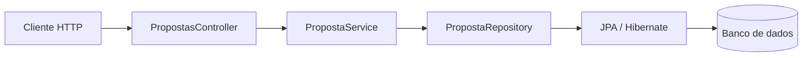

# Tutorial 2 — Persistência com JPA e ORM

Use o [modelo acordado](00-modelo-dados.md) como contrato: `Proposta`, `Usuario`, `Categoria`, `Curso`, `PublicoAlvo` e `Curtida`. As entidades e relacionamentos devem preservar as regras descritas ali.

## Missão

Substituir o armazenamento em memória da etapa 01 por propostas guardadas num banco, mantendo o contrato HTTP. O fluxo passa a ter responsabilidades claras: controller cuida do HTTP, service das regras e repository do acesso a dados.

## 1. Desenhe o recurso

Antes de codificar, revise os atributos e regras de `Proposta` em [00-modelo-dados.md](00-modelo-dados.md). Associe cada proposta a públicos-alvo da lista controlada e disponibilize todos os cursos ativos no catálogo. Curtidas são associações entre usuário e proposta para impedir duplicatas.

## 2. Implemente em pequenas entregas

1. Adicione as dependências Spring Data JPA, Spring Boot Flyway, H2 para desenvolvimento local, o conector do banco escolhido e suporte Flyway para esse banco.
2. Crie entidades `Proposta`, `Usuario`, `Categoria`, `Curso` e `PublicoAlvo` com `@Entity`, chaves e campos conforme o modelo. Mapeie as relações muitos-para-muitos com cursos e públicos-alvo.
3. Crie um repository estendendo `JpaRepository<Proposta, Long>`.
4. Crie também a entidade associativa `Curtida` com chave única (`usuarioId`, `propostaId`) para impedir curtidas duplicadas. Substitua o armazenamento em memória do `PropostaService` por repositories.
5. Faça o controller continuar recebendo e devolvendo DTOs, sem expor detalhes da entidade.
6. Adicione validações de entrada e respostas HTTP coerentes: `201 Created` ao criar, `404 Not Found` para identificador inexistente e `204 No Content` ao excluir com sucesso.
7. Configure o perfil local com H2 para experimentação. Use migrações versionadas quando o esquema passar a ser compartilhado; confira como Flyway está configurado antes de misturar criação automática de esquema e migrações.

Organize os pacotes por responsabilidade (por exemplo `controller`, `service`, `repository`, `domain` e `dto`) mantendo a convenção já usada no projeto quando fizer sentido.

## 3. Construa operações úteis

Implemente CRUD com identificador (`GET /api/propostas/{id}`, `PUT /api/propostas/{id}`, `DELETE /api/propostas/{id}`) e uma listagem paginada (`GET /api/propostas`) com 10 propostas por página. Acrescente filtros por categoria, conteúdo, público-alvo controlado e curso com parâmetros de consulta. Defina como combinar filtros e o que acontece quando nenhum resultado é encontrado.

Para curtidas, implemente `PUT /api/propostas/{id}/curtida` para registrar a curtida do usuário atual e `DELETE` na mesma rota para removê-la. A chave composta garante uma curtida por pessoa e a contagem não pode ser alterada por um PUT genérico.

## Padrões em contexto

O **Repository** é uma abstração de acesso a dados popularizada por DDD; `JpaRepository` já fornece operações comuns. A separação controller/service/repository é organização em camadas/MVC, não um motivo para inventar um GoF. Se a lógica de filtros crescer e houver algoritmos intercambiáveis, avalie **Strategy**. Se a montagem de critérios ficar extensa, avalie um Builder ou Specification; primeiro implemente a solução simples e observe o problema real.

## Desafio

Atualize a coleção Insomnia com os novos caminhos, exemplos JSON, identificadores e filtros. Teste o ciclo criar → consultar → filtrar → atualizar → excluir. Inclua um caso de identificador inexistente e um de dados inválidos.

## Pronto quando

- Os dados continuam disponíveis após reiniciar a aplicação no banco escolhido.
- As camadas têm responsabilidades compreensíveis.
- As rotas suportam filtros documentados e erros previsíveis.
- A coleção Insomnia reflete o contrato implementado.
