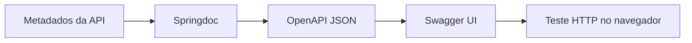

# Tutorial 3 — OpenAPI e Swagger UI

## Missão

Gerar documentação interativa a partir da API, de modo que outra equipe descubra rotas, parâmetros e respostas sem ler o código-fonte.

## 1. Confirme a dependência

O `build.gradle` já declara `springdoc-openapi-starter-webmvc-ui`. Inicie a aplicação e confira a interface em `http://localhost:8080/swagger-ui/index.html` e o documento JSON em `http://localhost:8080/v3/api-docs`. Se a rota diferir, confira a versão do springdoc e o log de inicialização.

## 2. Torne o contrato legível

Adicione descrições curtas aos endpoints, parâmetros, DTOs e campos. Para cada operação, informe propósito, formato de entrada, sucesso e erros esperados. Use exemplos que representem propostas plausíveis, sem dados pessoais reais. Prefira DTOs explícitos a expor entidades JPA.

## 3. Experimente como consumidor

Na Swagger UI, expanda uma rota, preencha os parâmetros e use **Try it out**. Compare a chamada com a coleção Insomnia. Quando a API incluir segurança, atualize os esquemas OpenAPI e use o botão **Authorize** para fornecer as credenciais ou token definidos pela aplicação.

## Desafio

Peça a outra dupla que use somente a Swagger UI para descobrir como criar e filtrar uma proposta. Anote qualquer informação que faltou e corrija as descrições.

## Pronto quando

- O documento OpenAPI lista as rotas reais, parâmetros e modelos.
- A Swagger UI permite executar operações no ambiente local.
- Erros e respostas de sucesso estão descritos com exemplos úteis.
