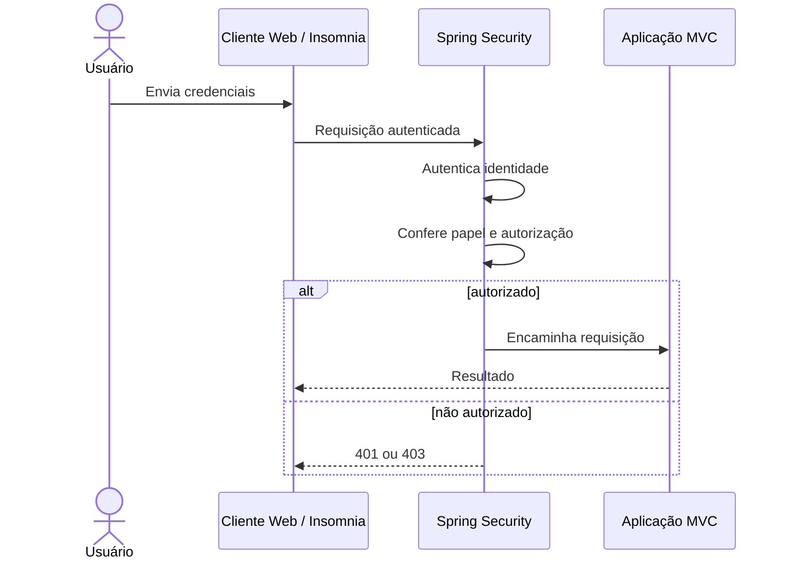

# Tutorial 4 — Spring Security: ADMIN e USER

## Missão

Proteger os dados e permitir que cada pessoa use apenas as operações adequadas. A turma distinguirá autenticação (quem é você?) de autorização (o que pode fazer?).

## 1. Escreva a matriz de acesso

Comece pela regra do produto e ajuste com a turma:

| Ação | Anônimo | USER | ADMIN |
|---|---:|---:|---:|
| Consultar propostas públicas | Sim | Sim | Sim |
| Publicar proposta | Não | Sim | Sim |
| Curtir proposta | Não | Sim | Sim |
| Administrar/remover qualquer proposta | Não | Não | Sim |
| Manter categorias e públicos-alvo | Não | Não | Sim |
| Manter o catálogo de cursos | Não | Não | Sim |
| Consultar todos os cursos ativos e catálogos ativos | Sim | Sim | Sim |

O autor pode editar ou arquivar a própria proposta. A autorização por propriedade precisa conferir a identidade autenticada, não confiar em um `autorId` enviado pelo cliente. Públicos-alvo são uma lista controlada; o catálogo apresenta todos os cursos ativos.

## 2. Configure e percorra o fluxo

Adicione o starter Spring Security e configure explicitamente as rotas públicas e protegidas. Para o exercício, escolha um mecanismo de autenticação adequado e documente como credenciais são criadas e armazenadas. Nunca grave senhas em texto puro: use um encoder de senha. Atribua papéis no servidor e valide permissões no backend.

Use `401 Unauthorized` para ausência/falha de autenticação e `403 Forbidden` para identidade autenticada sem permissão. Proteja também operações chamadas fora do navegador; esconder um botão na interface não protege uma rota.

## 3. Atualize os clientes

Acrescente login/autenticação à coleção Insomnia seguindo o mecanismo escolhido. Atualize o OpenAPI para mostrar como autorizar chamadas. Decida a política de CSRF de acordo com o tipo de cliente e armazenamento das credenciais; não desative proteção por copiar uma configuração sem compreender o fluxo.

## Desafio

Teste cada linha da matriz para usuário anônimo, USER e ADMIN. Inclua tentativas de acesso direto às rotas administrativas e de editar proposta de outra pessoa.

## Pronto quando

- Toda rota tem regra de acesso documentada.
- Papéis são atribuídos e verificados no servidor.
- Respostas 401/403 são distintas e coerentes.
- A documentação interativa permite autenticar e chamar as rotas protegidas.
