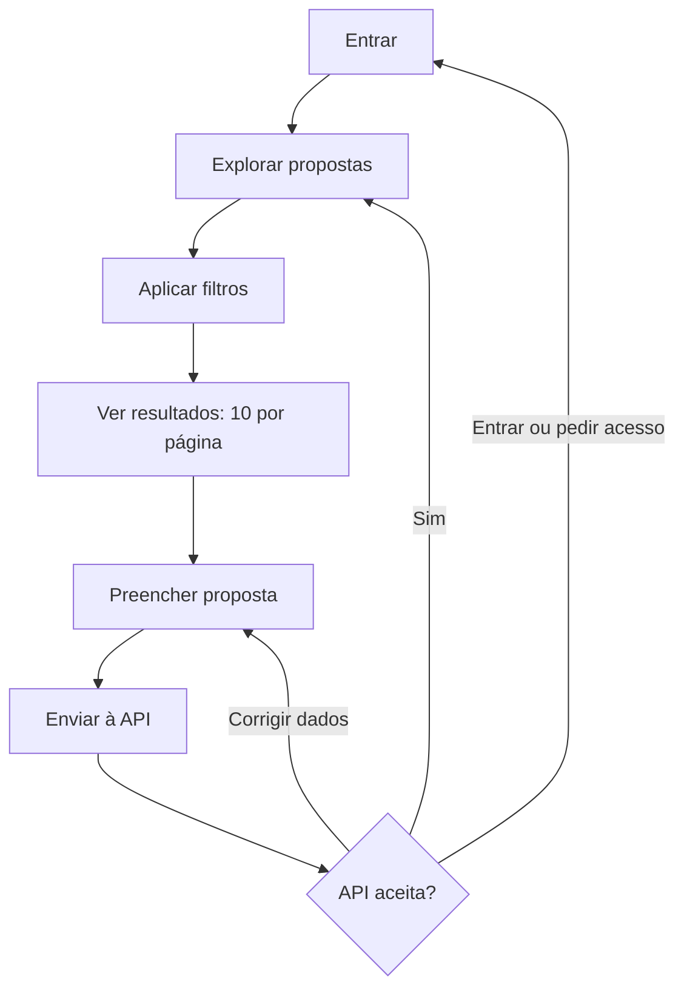

# Tutorial 5 — Aplicação Web para publicar propostas

## Missão

Construir uma interface para entrar, explorar propostas e publicar uma ideia interdisciplinar usando a API. A interface é outra cliente HTTP; as regras e permissões continuam pertencendo ao backend.

## 1. Desenhe a jornada

Comece com três telas: entrar, listar/filtrar propostas e cadastrar proposta. Inclua estados de carregamento, lista vazia, validação, erro de rede e sucesso. Faça um protótipo simples e peça a um colega para concluir a tarefa de publicar uma proposta.

## 2. Conecte a interface

Use os endpoints e os exemplos da OpenAPI como contrato. Separe chamadas HTTP de componentes visuais para que a interface apresente estado e mensagens sem duplicar regras de negócio. Envie apenas os campos editáveis; a API deve obter a identidade do autor da sessão autenticada.

Trate respostas HTTP: mostre erros de validação junto aos campos, permita tentar novamente em falhas transitórias e atualize a lista depois de uma criação bem-sucedida. Nunca inclua segredos permanentes no código entregue ao navegador.

## MVC, MVP e MVVM

No backend Spring MVC, o Controller interpreta HTTP e delega ao Service. Na interface, MVC, MVP e MVVM são formas distintas de separar apresentação e estado. Em MVP, o Presenter coordena a View; em MVVM, a View observa estado e comandos de um ViewModel. Escolham um estilo apropriado à tecnologia de interface ensinada e comparem como cada um facilita testes e manutenção. Não misturem os nomes das camadas do frontend e do backend como se fossem uma única arquitetura.

## Desafio

Implemente login, listagem com filtros e formulário de publicação. O formulário deve selecionar cursos ativos e públicos-alvo da lista controlada. Em seguida, peça a outro grupo que publique uma proposta e encontre uma ideia associada a outro curso sem ajuda verbal. Rascunhos, comentários e anexos ficam para melhorias futuras. Anote onde a interface deixou dúvidas.

## Pronto quando

- A pessoa usuária consegue autenticar-se, explorar e publicar.
- A interface apresenta estados vazios, de carregamento e de erro.
- O backend continua validando os dados e controlando permissões.
- O grupo consegue explicar qual padrão de apresentação adotou e por quê.
